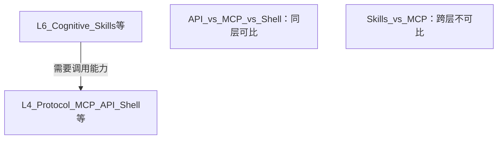
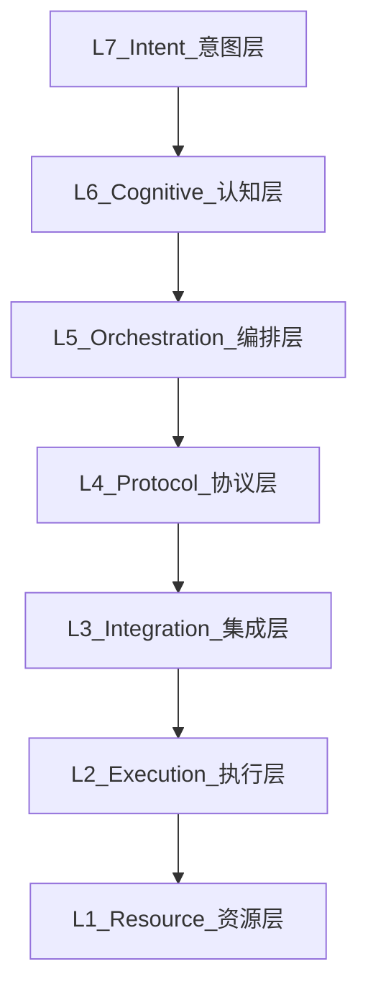

# Agent 七层模型：Skills 与 MCP 的分层理解

> 概念框架参考：[知乎 @酱紫君](https://www.zhihu.com/question/2001699652010001084/answer/2020119099011776889)（OSI 类比与分层思路）。  
> 本文为 ToolBox memory-bank 内的独立整理与解析，非原文转载。

---

## 核心结论（TL;DR）

1. **Skills 与 MCP 不在同一抽象层级**，比较「谁更好」如同比较 HTTP 与 REST 设计指南——问题本身错位。
2. **Skill 是过载术语**：业界把 Prompt 模板、脚本封装、领域文档、Workflow 编排都称作 skill，边界模糊，容易让人误以为「只学 skill 就够」。
3. **互补而非替代**：Skill 指导 agent *如何思考与决策*；MCP/API 提供 agent *如何连上外部能力*。缺任一环节，系统都不完整。
4. **比较规则**：只有同层概念才应横向对比（例如 MCP vs OpenAPI vs Shell；Skill vs LoRA vs Memory）。
5. **「API 优于 MCP」「Shell 优于 MCP」** 至少是 L4 同级之间的选型争论；**「Skills 优于 MCP」** 则根本不成立——跨层比较没有「优于」关系。
6. **Skills 在 L6 并非不可替代**：LoRA、World Memory 等是同级、往往更省 token 的认知修正方案。

---

## 一、为何「Skills vs MCP」是错位比较

### 1.1 历史类比：范式战争的重演

FP 与 OOP 曾长期被包装成零和对抗，结果往往是教条化实践——例如前端为了「函数式」而函数式，反而引入大量不必要的抽象。  
Skills 与 MCP 的讨论正在重复同一模式：**把互补组件包装成路线之争**，掩盖了各自真正要解决的问题。

### 1.2 层级错位

| 维度 | Skills（典型用法） | MCP |
| :--- | :--- | :--- |
| 抽象层级 | 认知 / 应用实践 | 协议 / 能力接入 |
| 核心问题 | 怎么做、先做什么、依据什么知识 | 用什么标准暴露工具、如何传输调用 |
| 缺少它时 | agent 缺乏领域方法与推理框架 | agent 无法稳定连接数据库、文件系统、第三方 API |
| 典型产物 | Markdown 指令、领域 playbook、任务分解模板 | `tools/list`、`tools/call`、stdio/HTTP 传输 |

一个具体例子：Skill 可以写「查询用户表前先检查连接池状态」，但**建立数据库连接**仍依赖 L4 的 MCP 服务器或等价 API。没有协议层，认知层只有文字，没有动作。

### 1.3 「Skill」术语过载

当前生态里，以下完全不同的事物常被统一称为 skill：

| 实际形态 | 作用 | 更接近的层级 |
| :--- | :--- | :--- |
| 工具使用说明（Prompt） | 教模型何时、如何调用某工具 | L6 认知 |
| 封装 API 的脚本/函数 | 把调用逻辑固化成可复用单元 | L4–L5（协议 + 编排） |
| 领域知识 Markdown | 提供背景、约束、最佳实践 | L6 认知（Memory 的静态形式） |
| 多步 Workflow 定义 | 串联任务、管理状态与分支 | L5 编排 |

术语边界不清，加上大量 AI 生成教程的推波助澜，容易形成误解：**skill 包罗万象 → 只要 skill 不需要 MCP**。这是对架构层次的简化误读。

### 1.4 同层可比，跨层不存在「优于」

争论「谁更好」时，先确认是否在**同一层**：

| 比较 | 是否成立 | 说明 |
| :--- | :--- | :--- |
| API vs MCP | 成立 | 都在 L4，解决「用什么标准暴露、传输外部能力」 |
| Shell vs MCP | 成立 | 都在 L4，是直接跑命令还是走 MCP 规范，属于同级选型 |
| Skills vs MCP | **不成立** | L6 vs L4，一个管「怎么想、怎么做」，一个管「怎么连上能力」，不在一条赛道上 |

因此：

- 讨论「API 比 MCP 好」或「Shell 比 MCP 好」——至少是**协议层内部**的合理争论（结论因场景而异）。
- 讨论「Skills 比 MCP 好」——**这类比较本身不存在**；两者互补，不能谈谁取代谁。

---

## 二、Agent 七层模型

借鉴 OSI 分层思路：每层只解决一类问题，向上暴露接口、向下依赖能力，避免跨层耦合。

| 层级 | 名称 | 职责 | 典型对应物 |
| :--- | :--- | :--- | :--- |
| **L7** | Intent（意图层） | 接收自然语言、多模态等原始输入，形成可处理的意图 | 用户消息、语音、截图 |
| **L6** | Cognitive（认知层） | 理解、拆解、规划、推理、决策 | Skills、System Prompt、LoRA、Memory |
| **L5** | Orchestration（编排层） | 管理长任务的状态、步骤顺序、重试与分支 | Workflow、Task Graph、Cursor Plan |
| **L4** | Protocol（协议层） | 以标准格式暴露可调用的外部能力 | MCP、OpenAPI、Shell 命令协议 |
| **L3** | Integration（集成层） | 把协议能力接入 agent 运行时，处理鉴权、序列化、错误 | Agent 框架（LangGraph、Cursor Agent、MAUI 工具宿主） |
| **L2** | Execution（执行层） | 提供隔离、可控的代码/命令运行环境 | Sandbox、Docker、WASM、解释器 |
| **L1** | Resource（资源层） | 最终被读写的物理或逻辑实体 | OS、文件系统、数据库、网络 |

### 层级关系

数据与控制流自上而下：意图被理解 → 规划出步骤 → 通过协议调用能力 → 框架完成集成 → 沙箱内执行 → 触及真实资源。

---

## 三、各层要点（ToolBox / Cursor 语境）

### L7–L6：从输入到决策

用户说「帮我对齐两个目录并生成报告」属于 L7。Agent 将其拆解为：选目录、比对、输出 diff、写报告——这是 L6 的规划与领域知识（Skill/Memory 发挥作用的地方）。

#### L6 认知层的多种实现（Skills 并非唯一）

当模型在某领域**行为不对、知识不够**时，需要在 L6 做「认知修正」。Skills、LoRA、World Memory 都服务这一层，**互为替代或组合**，与 MCP（L4）无关。

##### 三方案横向对比

| 维度 | Skills / Rules / Prompt | LoRA（低秩适配微调） | World Memory（外部记忆 / RAG） |
| :--- | :--- | :--- | :--- |
| **知识放哪** | 上下文里的文本（Prompt） | 模型权重里的适配器参数 | 外部存储（文件、向量库、索引） |
| **怎么生效** | 每次对话把文档注入 system/context | 推理时加载 LoRA 权重，改变输出分布 | 按 query 检索片段，再塞进当轮上下文 |
| **更新成本** | 改 Markdown 即可，**零训练** | 需重新采集数据、训练/合并适配器 | 更新源文档或重建索引，**零训练** |
| **推理 token** | **高**——规范越大，每轮越贵 | **低**——不必每轮重复灌大段规范 | **中**——只检索相关段落，按需计费 |
| **适合修正什么** | 流程规范、禁忌、工具用法、临时策略 | 稳定风格、固定领域句式、重复性模式 | 大量事实、项目历史、API 文档、代码库结构 |
| **典型局限** | 上下文窗口上限；长文档稀释注意力 | 更新慢；难表达「本次绝对不要 commit」类硬规则 | 检索质量决定上限；可能漏掉未索引知识 |
| **ToolBox 对应物** | `AGENTS.md`、Cursor Rules/Skills、用户 Rules | （通常不由应用项目直接提供；多为模型厂商/自建微调） | `memory-bank/`、`activeContext.md`、codebase indexing |

##### 同一问题，三种 L6 做法（举例）

**场景 A：让 Agent 遵守 ToolBox 架构约定**

> 用户：「给 Shared 里加一个 JSON 工具页。」  
> 期望：`.razor` + `*VM.cs` 同目录、Shared 禁止 `@rendermode`、Web 路由要改 `WebRouteRegistry`。

| 方案 | 具体做法 | 大致 token / 成本印象 |
| :--- | :--- | :--- |
| **Skills** | 每轮携带 `AGENTS.md`（~60 行）+ 相关 Skill；模型直接读规则 | 每会话固定 **~800–1500 token** 规则 overhead，对话越长重复越多 |
| **LoRA** | 用 ToolBox 历史 PR / 规范样本微调「Blazor 工具页」适配器；推理时不注入全文 AGENTS | 训练一次性成本；单轮 **少占数百～上千** 规则 token，但「禁止 commit」类硬约束仍建议保留短 Rules |
| **World Memory** | 规范写入 `memory-bank/systemPatterns.md`；Agent 仅在「新增工具页」时检索「组件与 VM 同目录」「Web 路由白名单」等段落 | 每轮 **~200–600 token** 检索结果，取决于索引粒度；`AGENTS.md` 可缩短为索引入口 |

**场景 B：Agent 不了解某个已有工具的实现**

> 用户：「目录同步工具是怎么调用 `IDirectorySyncService` 的？」

| 方案 | 具体做法 | 效果 |
| :--- | :--- | :--- |
| **Skills** | Skill 里写死「先读 DirectorySync 相关文件路径与接口说明」 | 可行，但 Skill 要维护一份**重复的**路径清单，易过期 |
| **LoRA** | 微调让模型「熟悉」ToolBox 服务命名习惯 | 对**具体文件路径**仍可能幻觉；LoRA 擅长度型模式，不擅长度型事实 |
| **World Memory** | 语义搜索 / `@` 引用 `IDirectorySyncService.cs`、`DirectorySyncModels.cs` 片段 | **事实准确**；只拉 2–3 个相关文件进上下文，不必加载整库 |

**场景 C：修正「总是用错误方式调数据库」**

> 期望：先检查连接串环境变量，再查询；禁止在日志里打印密码。

| 方案 | 能否单独解决 | 说明 |
| :--- | :--- | :--- |
| **Skills** | L6 可以 | Skill 写清步骤与禁忌；**但真正连库**仍要 L4 的 MCP/API |
| **LoRA** | L6 部分可以 | 可强化「ORM 写法、参数化查询」习惯；**连接串从哪来**仍靠 L4 |
| **World Memory** | L6 部分可以 | 存「本项目 DB 配置约定」文档，用时检索；**执行查询**仍靠 L4 |

三个场景共同说明：**L6 方案只影响「怎么想」**；连库、读盘、跑命令永远还要 L4→L1。Skills 不是不可替代，而是在「要快、要强约束、文档不大」时最省事。

##### 何时优先选哪种（L6 内部选型）

| 优先选 | 条件 |
| :--- | :--- |
| **Skills / Rules** | 规则少而硬（安全、git 协议、禁止改库配置）；需要立刻生效、团队可读可 review |
| **LoRA** | 行为/风格高度重复（固定代码风格、固定评审口吻）；调用量极大、Prompt 重复成本已明显 |
| **World Memory** | 知识体积大、更新频、且**每次只用其中一小部分**（整库架构、历史决策、长文档） |
| **组合** | 常见最佳实践：短 Rules（硬约束）+ Memory（事实）+ 必要时小 Skill（单次任务 playbook）；LoRA 作底层风格兜底 |

##### 与「Skills vs MCP」的区别（再强调）

| 争论 | 性质 |
| :--- | :--- |
| Skills vs LoRA vs World Memory | **L6 内部**：都用更省或更合适的办法修正认知，可以比 token、比维护成本 |
| Skills vs MCP | **跨层**：不存在「谁更好」；MCP 不提供「别在 Shared 写 @rendermode」这类认知，Skills 也不提供数据库 TCP 连接 |

### L5：长任务的状态管理

多步任务需要记住「第 2 步已完成、第 3 步因权限失败需重试」。Workflow、Plan 模式、TODO 列表都属于编排层，与「知道怎么做」（L6）和「能调用工具」（L4）都不同。

### L4–L3：能力与框架

MCP 定义了 tools 的发现与调用格式；Cursor Agent、Blazor 宿主则负责把这些能力挂进运行时。ToolBox 中的 `IFolderPickerService`、`IDirectorySyncService` 等平台抽象，本质上是 L3 对 L1 资源的集成封装。

### L2–L1：执行与资源

即使 L6 规划正确、L4 协议可用，仍需要 L2 沙箱执行脚本，最终 L1 的 fs/db 才会被读写。Windows MAUI 与 Web WASM 的差异，大量体现在 L2–L3 的执行与集成环境不同。

---

## 四、同级比较示例

| 合理比较 | 不合理比较 |
| :--- | :--- |
| MCP vs OpenAPI vs Shell vs 自定义 JSON-RPC | Skills vs MCP |
| Cursor Skill vs LoRA vs World Memory vs Project Instructions | Skill vs Docker |
| LangGraph vs Temporal vs Plan 模式 | Workflow vs 数据库 |
| Docker vs Firecracker vs WASM Sandbox | Memory vs HTTP |

---

## 五、对 ToolBox 协作的启示

1. **AGENTS.md / Skills / Rules** 主要服务 L6——约定如何思考、如何组织代码，不替代 MCP 或平台服务接口。
2. **MCP、Shell、平台 Service 接口** 服务 L3–L4——提供可调用的真实能力；MAUI 与 Web 各自实装同一 Shared 接口，正是集成层的分平台实现。
3. **新增能力时先问层级**：是补认知（文档/Skill）、补编排（Workflow）、还是补协议/集成（新 Service、MCP server）？层级清晰，避免把一切都塞进 skill。

---

## 参考

- 分层思路来源：[知乎 @酱紫君 — Agent 七层模型讨论](https://www.zhihu.com/question/2001699652010001084/answer/2020119099011776889)
