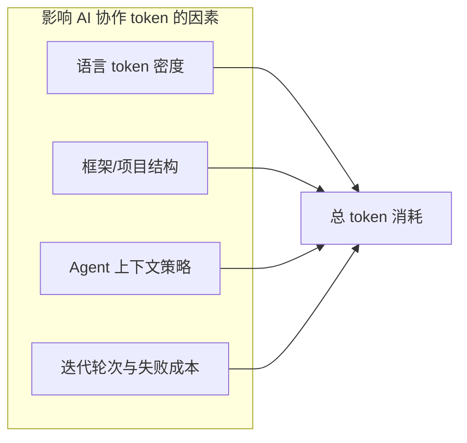

# Token 消耗结论：C# vs React+TS 与系统研究综述

> 针对 ToolBox 类项目（Blazor / MAUI + Shared RCL vs React + TypeScript）的 AI 协作 token 消耗分析，及现有系统研究文献整理。  
> 更新：2026-06

---

## 核心结论（TL;DR）

1. **没有**直接对比「C# Blazor vs React+TS 同一 ToolBox 规格」的学术论文。
2. 现有系统研究显示：**语言 token 密度有差异，但框架/项目结构对 agent 总 token 的影响往往更大**。
3. 对 ToolBox 而言，C# 通常比 React+TS **略多耗 token（约 1.3～1.8×/单页对话）**，但远小于早期「JS 单文件 3～4× 更省」的粗略估计——因为 **React+TS 也常用 page + hook 双文件，且有类型开销**。
4. **真正拉开差距的**是：多项目（Shared / Web / Web.Client / MAUI）、平台抽象（接口 + 多套实现）、MVVM 属性样板、配置文件与 DI 注册——而非 C# 语法本身。

---

## 一、ToolBox 项目实测规模（C# 侧）

| 指标 | 数值 |
|------|------|
| `.cs` + `.razor` 文件 | ~128 |
| 代码行数 | ~13,000 |
| 项目数 | 5（MAUI / Shared / Web / Web.Client / CommonHelp） |
| 每个工具页 | 通常 2 文件：`.razor` + `*VM.cs` |

### 举例：JSON 格式化页

| 实现 | 文件 | 行数 | 约 token |
|------|------|------|----------|
| C# Blazor | `JsonFormat.razor` + `JsonFormatVM.cs` | ~86 + ~448 ≈ 534 | ~4,000～5,500 |
| React + TS | `JsonFormatPage.tsx` + `useJsonFormat.ts` | ~100～130 + ~180～220 ≈ 280～350 | ~2,000～3,000 |

**单页差距约 1.5～2×**，主要因 C# VM 的 `SetProperty` 属性样板，而非「JS 不分层」。

### Web 渲染模型（影响上下文范围）

- **SSR 壳**：`ToolBox.Web/Components/App.razor`（无 `@rendermode`）
- **WASM 交互**：`<ToolRouter @rendermode="InteractiveWebAssembly" />` 及 Shared 工具页
- Shared **不设** `@rendermode`（MAUI 兼容）

---

## 二、修正后的 C# vs React+TS 对比

### 之前容易高估 JS 省 token 的原因

| 误区 | 修正 |
|------|------|
| JS 一个 `.tsx` 80 行搞定 | React+TS 常见 **page + hook + types**，也是双文件 |
| JS 没有平台抽象 | Tauri/Electron 桌面版同样需要 clipboard 等抽象 |
| C# 一定多 2～3 倍 | 单页通常 **1.5～2×**；纯 Web 对 pure Web 约 **1.2～1.5×** |
| 全库 C# 13k vs JS 4k | React+TS Web 工具箱更合理约 **6k～9k** |

### 分项对比

| 维度 | C# Blazor (ToolBox) | React + TS |
|------|---------------------|------------|
| 单页结构 | `.razor` + `*VM.cs` | `.tsx` + `useXxx.ts` |
| UI 层 | MudBlazor（较啰嗦） | MUI/shadcn（相当） |
| 样板 | `SetProperty`、namespace、DI | `useState`、interface、import |
| 架构额外成本 | 5 项目 + 平台三套实现 + csproj/slnx | 单仓通常更紧凑 |
| MAUI 全功能 | 原生支持 | 需 Tauri/Electron，总 token 差距缩小 |

---

## 三、系统研究文献（按类型）

### 1. 语言 Token 密度（与 LLM 最直接相关）

#### [cross-lang-token-density](https://github.com/tylevnovik/cross-lang-token-density)（2025，可复现）

- **方法**：Rosetta Code 693 任务 + LeetCode 3681 配对任务，同一 tokenizer
- **结论**（Python = 1.00）：

| 语言 | 相对 token |
|------|------------|
| C | 1.77× |
| Rust | 1.57× |
| Go | 1.55× |
| Java | 1.47× |
| TypeScript | 1.45× |
| JavaScript | 1.26× |

- **TS 比 JS 多约 15%**（类型注解溢价）
- **局限**：算法题，非全栈 UI；**未单独测 C#**（Java 可作近似）

#### [Which programming languages are most token-efficient?](https://martinalderson.com/posts/which-programming-languages-are-most-token-efficient/) — Martin Alderson（2025）

- Rosetta Code 19 语言；C 与 Clojure 差 **2.6×**
- 动态语言更省；**JS 在动态语言中偏啰嗦**
- Haskell/F# 因类型推断接近动态语言效率
- 后续结论：**框架差异 > 语言差异**

#### [vibe-coding-lang-bench](https://github.com/adriangalilea/vibe-coding-lang-bench)（2025）

- 同一 spec：Python / Rust / Elixir 实现 CLI + REST API
- Rust 最终 token 约 **1.4×** Python；改功能 delta **+42%**
- 强调 **迭代成本**（读/改/验证循环）比静态代码量更贴近 AI 协作

---

### 2. 经典代码冗长度（LOC，非 token）

#### [A Comparative Study of Programming Languages in Rosetta Code](https://bugcounting.net/pubs/icse15.pdf) — Nanz & Furia, **ICSE 2015**

- **peer-reviewed**；Rosetta Code 大量任务，TLOC（非空非注释行）
- Java 约为函数式/脚本语言的 **2.2～2.9×**
- OOP 组内 Java 略优于 C#（差异不大）
- LOC 与 token **相关但不等同**

---

### 3. 框架 / Agent 维度

#### [Which web frameworks are most token-efficient for AI agents?](https://martinalderson.com/posts/which-web-frameworks-are-most-token-efficient-for-ai-agents/) — Alderson, 2026

- 19 框架同一 blog app + AI agent 搭建/扩展
- Minimal API 比全功能框架省最多 **2.9×**
- 后续加功能时差距缩小，minimal 仍整体更省
- **对 ToolBox**：Blazor + MudBlazor + 多项目 ≈ 全功能框架，context 比 Vite+React 单仓更胖

---

### 4. AI 编程效率（一般不按语言比 token）

| 研究 | 链接 | 要点 |
|------|------|------|
| GitHub Copilot 受控实验 | [GitHub Blog 2022](https://github.blog/news-insights/research/research-quantifying-github-copilots-impact-on-developer-productivity-and-happiness/) | 任务快 ~55%；未比语言 token |
| Copilot 真实项目 | [arXiv:2406.17910](https://arxiv.org/pdf/2406.17910) | JS 省时 ~50%，Java 次之；C/C++ 复杂场景更差 |
| 微软/Accenture 田野实验 | [Demirer et al.](https://demirermert.github.io/Papers/Demirer_AI_productivity.pdf) | Copilot 对产出影响；未分语言 token |
| SWE-Effi | [arXiv:2509.09853](https://arxiv.org/html/2509.09853v2) | **EuTB** 指标；agent 修 issue 的 token 预算 |
| Local-Splitter | [arXiv:2604.12301](https://arxiv.org/html/2604.12301) | 7 种降 token 策略；coding-agent workload |

---

### 5. Token 优化（架构/上下文）

- [Optimizing Token Consumption in LLMs for Code Repair](https://arxiv.org/html/2504.15989v2) — CoT 推理 token 与 prompt 策略
- Context engineering / `AGENTS.md` — 稳定规则外置，比换语言对 agent 总 token 影响更直接

---

## 四、影响因素模型

| 维度 | 现有证据 | 对 ToolBox 的启示 |
|------|----------|-------------------|
| 同算法 token | cross-lang-token-density | TS≈Java档；JS 略省 |
| 同任务 LOC | ICSE 2015 | OOP > 脚本；C#≈Java |
| 全栈 UI | Alderson 框架 benchmark | 多项目+重框架 >> 语法 |
| Agent 总成本 | SWE-Effi, vibe-coding-lang-bench | 失败重试、多文件读盘常是主因 |

---

## 五、ToolBox 专用 Mini Benchmark 方案（可选）

若需论文级自证，可参考：

1. **配对任务**：选 5 个工具页（JWT、JSON Format…），固定功能 spec
2. **两种实现**：Blazor(razor+VM) vs React+TS(page+hook)
3. **指标**：
   - 代码 token（tiktoken / 模型 tokenizer）
   - agent 同一 prompt 下的总 input/output token、轮次、涉及文件数
4. **分层报告**：仅业务逻辑 / 含 UI / 含路由 / 含多项目上下文

---

## 六、推荐阅读顺序

1. **ICSE 2015 Rosetta Code** — 经典、可引用
2. **cross-lang-token-density** — 直接对接 LLM tokenizer
3. **Alderson 框架文** — 解释 ToolBox 多项目 Blazor context 为何胖
4. **vibe-coding-lang-bench** — 改功能 delta token
5. **SWE-Effi** — agent 修 bug 的 token 预算

---

## 七、实用建议（AI 协作）

- 比语言不如比 **架构**：Shared + 双端 + 多 csproj 是 C# 侧 token 大头
- C# 想省 token：减少 VM 属性样板、合并注册文件、避免一次改多个项目
- React+TS 也会因 hook 拆分、类型文件、monorepo 变胖
- 维护好 `AGENTS.md` / memory-bank，比换语言更直接影响 agent 总 token
